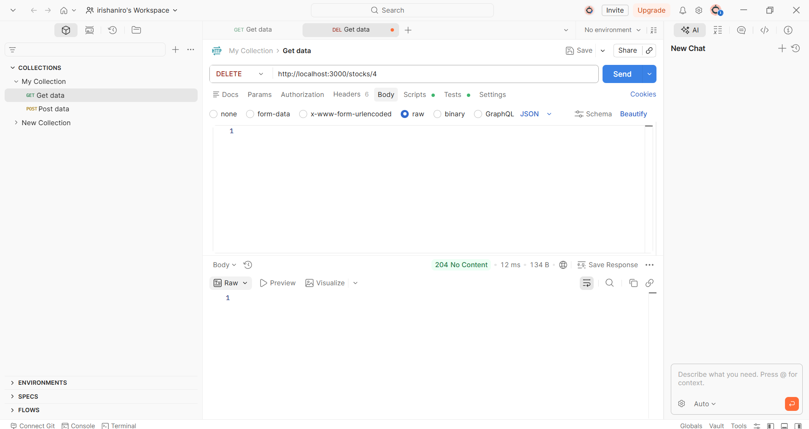

# 4 - Cоздание бэкенда на Express.js <!-- omit in toc -->

> Лабораторная работа 4 для студентов курса "Проектирование сетевых приложений" 4 семестра кафедры ИУ5 МГТУ им Н.Э. Баумана.

## Содержание <!-- omit in toc -->

- [Цель работы](#цель-работы)
- [Начало работы](#начало-работы)
- [Задание](#задание)
- [Указания по выполнению лабораторной работы](#указания-по-выполнению-лабораторной-работы)
    - [Требования к реализации](#требования-к-реализации)
    - [Структура проекта](#структура-проекта)
- [Пример программы](#пример-программы)
- [Результат работы](#результат-работы)

## Цель работы

Освоить создание бэкенд-сервера на платформе Node.js с использованием фреймворка Express.js для разработки REST API.

---

## Начало работы

Зайдите в свою локальную директорию с репозиторием для выполнения лабораторных работ. Заберите ветку с соответствующей лабораторной работой из общего репозитория:

```sh
git pull upstream
```

**или**

```sh
git pull upstream working-with-cards
```

Переключитесь на ветку с текущей лабораторной работой:

```sh
git checkout working-with-cards
```

Свяжите ветку локального репозитория с вашим удаленным репозиторием:

```sh
git push --set-upstream origin working-with-cards
```

## Задание

Реализация на Node.js собственного веб-сервиса для API, данные хранятся в json файле. Тестирование через Postman/Insomnia 5 методов: список с фильтрацией, получение одной записи, добавление, редактирование, удаление

---
## Указания по выполнению лабораторной работы
1. Работа выполняется индивидуально в соответствии с вариантом
2. Код должен быть организован по слоистой архитектуре (routes → controllers → services)
3. Все эндпоинты должны быть протестированы через Postman или аналогичный инструмент
4. Проект должен быть загружен на GitHub

---

## Требования к реализации
1. Проект должен быть написан на Node.js с использованием фреймворка Express.js
2. Код должен быть организован по слоистой архитектуре (routes → controllers → services)
3. Все зависимости должны быть указаны в package.json
4. Код должен быть чистым, читаемым и сопровождаемым
5. Должна быть корректная обработка ошибок (try-catch, статус-коды)

---

## Структура проекта


---
## Пример программы

Точка входа

```javascript
const express = require('express');
const path = require('path');
const stocksRouter = require('./routes/stocks');
const stocksService = require('./services/stocksService');

const app = express();
const PORT = 3000;

const DATA_FILE_PATH = path.join(__dirname, 'data', 'stocks.json');

stocksService.init(DATA_FILE_PATH);

app.use(express.json());

app.use((req, res, next) => {
    console.log(`[${new Date().toISOString()}] ${req.method} ${req.url}`);
    next();
});

app.use('/stocks', stocksRouter);

app.use((req, res) => {
    res.status(404).json({ error: 'Маршрут не найден' });
});

app.use((err, req, res, next) => {
    console.error(err);
    res.status(500).json({ error: 'Внутренняя ошибка сервера' });
});

app.listen(PORT, () => {
    console.log(`Сервер запущен по адресу http://localhost:${PORT}`);
});
```
Маршруты

```javascript
const express = require('express');
const router = express.Router();
const stocksController = require('../controllers/stocksController');

router.get('/', stocksController.getAllStocks);
router.get('/:id', stocksController.getStockById);
router.post('/', stocksController.createStock);
router.patch('/:id', stocksController.updateStock);
router.delete('/:id', stocksController.deleteStock);

module.exports = router;
```

Контроллер

```javascript
const stocksService = require('../services/stocksService');

const getAllStocks = (req, res) => {
    const stocks = stocksService.findAll();
    res.json(stocks);
};

const getStockById = (req, res) => {
    const id = parseInt(req.params.id);
    const stock = stocksService.findOne(id);

    if (!stock) {
        return res.status(404).json({ error: 'Карточка не найдена' });
    }
    res.json(stock);
};

const createStock = (req, res) => {
    const { src, title, text } = req.body;

    if (!src || !title || !text) {
        return res.status(400).json({ error: 'Не все поля заполнены' });
    }

    const newStock = stocksService.create({ src, title, text });
    res.status(201).json(newStock);
};

const updateStock = (req, res) => {
    const id = parseInt(req.params.id);
    const updatedStock = stocksService.update(id, req.body);

    if (!updatedStock) {
        return res.status(404).json({ error: 'Карточка не найдена' });
    }
    res.json(updatedStock);
};

const deleteStock = (req, res) => {
    const id = parseInt(req.params.id);
    const success = stocksService.remove(id);

    if (!success) {
        return res.status(404).json({ error: 'Карточка не найдена' });
    }
    res.status(204).send();
};

module.exports = {
    getAllStocks,
    getStockById,
    createStock,
    updateStock,
    deleteStock
};
```

Работа с файлами

```javascript
const fs = require('fs');

const readData = (filePath) => {
    try {
        const data = fs.readFileSync(filePath, 'utf8');
        return JSON.parse(data);
    } catch (err) {
        console.error('Ошибка чтения файла:', err);
        return [];
    }
};

const writeData = (filePath, data) => {
    try {
        fs.writeFileSync(filePath, JSON.stringify(data, null, 2), 'utf8');
    } catch (err) {
        console.error('Ошибка записи файла:', err);
    }
};

module.exports = { readData, writeData };
```

---

## Результат работы




---
