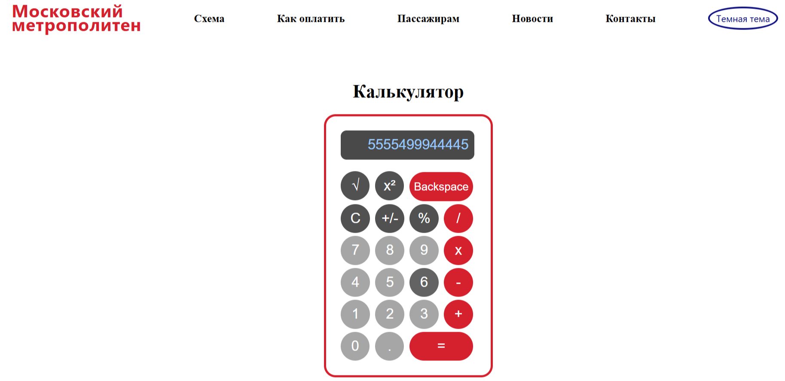

# 2 - Calculator. JavaScript <!-- omit in toc -->

> Лабораторная работа 2 для студентов курса "Проектирование сетевых приложений" 4 семестра кафедры ИУ5 МГТУ им Н.Э. Баумана.

## Содержание <!-- omit in toc -->

- [Цель работы](#цель-работы)
- [Начало работы](#начало-работы)
- [Задание](#задание)
- [Указания по выполнению лабораторной работы](#указания-по-выполнению-лабораторной-работы)
	- [Общие советы](#общие-советы)
	- [Требования к реализации](#требования-к-реализации)
- [Пример программы, использующей класс Planet](#пример-программы-использующей-класс-planet)
- [Результат работы](#результат-работы)

## Цель работы

Цель данной лабораторной работы:

- Знакомство с инструментами построения пользовательских интерфейсов web-сайтов: HTML, CSS, JavaScript. В ходе выполнения работы, вам предстоит продолжить реализовывать простой калькулятор, и затем выполнить задания по варианту.

---

## Начало работы

Зайдите в свою локальную директорию с репозиторием для выполнения лабораторных работ. Заберите ветку с соответствующей лабораторной работой из общего репозитория:

```sh
git pull upstream
```

**или**

```sh
git pull upstream calculator_operation
```

Переключитесь на ветку с текущей лабораторной работой:

```sh
git checkout calculator_operation
```

Свяжите ветку локального репозитория с вашим удаленным репозиторием:

```sh
git push --set-upstream origin calculator_operation
```

## Задание

1. Создание калькулятора
2. Функции на JavaScript
3. Реализовать в калькуляторе индивидуальную операцию по вашей теме, функция должна быть встроена в логику калькулятора без дополнительных окон, alert

---
## Указания по выполнению лабораторной работы

### Общие советы

- Внешний вид калькулятора должен быть интуитивно понятным и аккуратным

- Все кнопки должны иметь обработчики событий (onclick)

- Реализовать поддержку ввода с клавиатуры (цифры, Enter, Escape, Backspace)

- Код должен быть модульным и хорошо структурированным (разделение на файлы: calculator.html, style.css, script.js)

- Использовать CSS-переменные для реализации светлой и тёмной темы

---

### Требования к реализации

- Код должен быть написан на чистом JavaScript
- Все стили вынесены в отдельный CSS-файл и используют CSS-переменные для реализации светлой и тёмной темы
- Для хранения чисел используются строковые переменные (a и b), результат вычислений сохраняется в a
- При вводе десятичной точки контролировать невозможность ввода более одной точки в числе
- При вводе точки первой автоматически добавлять 0
- Реализовать обработку всех кнопок калькулятора через обработчики событий (onclick)
- Реализовать переключение между светлой и тёмной темами через изменение атрибута data-theme

---

## Пример программы

```cpp
// Основные переменные для хранения чисел и операций
let a = '';              // Первое число
let b = '';              // Второе число
let selectedOperation = null;  // Выбранная операция

// Функция обработки ввода цифр и точки
function onDigitButtonClicked(digit) {
    if (!selectedOperation) {
        // Работа с первым числом
        if (digit === '.' && a === '') {
            a = '0.';
        } else if ((digit !== '.') || (digit === '.' && !a.includes('.'))) {
            a += digit;
        }
        outputElement.innerHTML = a;
    } else {
        // Работа со вторым числом
        if (digit === '.' && b === '') {
            b = '0.';
        } else if ((digit !== '.') || (digit === '.' && !b.includes('.'))) {
            b += digit;
        }
        outputElement.innerHTML = b;
    }
}

// Функция вычисления результата
function calculate() {
    switch(selectedOperation) {
        case '+': return (+a) + (+b);
        case '-': return (+a) - (+b);
        case 'x': return (+a) * (+b);
        case '/': return (+b) !== 0 ? (+a) / (+b) : 'Ошибка';
        default: return null;
    }
}

// Обработчик кнопки "="
document.getElementById("btn_op_equal").onclick = function() {
    if (a === '' || b === '' || !selectedOperation) return;
    const result = calculate();
    a = result.toString();
    b = '';
    selectedOperation = null;
    outputElement.innerHTML = a;
    updateResultColor(a);  // Изменение цвета результата
};
```

---

## Результат работы




---
