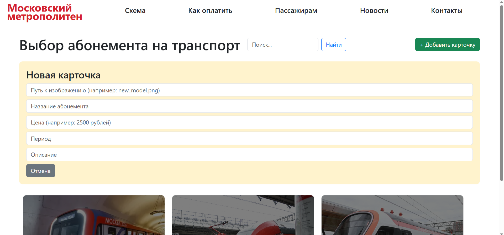

# 6 - Знакомство с promise и fetch, сборка клиентской части <!-- omit in toc -->

> Лабораторная работа 6 для студентов курса "Проектирование сетевых приложений" 4 семестра кафедры ИУ5 МГТУ им Н.Э. Баумана.

## Содержание <!-- omit in toc -->

- [Цель работы](#цель-работы)
- [Начало работы](#начало-работы)
- [Задание](#задание)
- [Указания по выполнению лабораторной работы](#указания-по-выполнению-лабораторной-работы)
	- [Общие советы](#общие-советы)
    - [Структура проекта](#структура-проекта)
	- [Требования к реализации](#требования-к-реализации)
- [Пример программы](#пример-программы)
- [Результат работы](#результат-работы)

## Цель работы

Цель данной лабораторной работы:

- Первая часть данной лабораторной работы заключается в изменении механизма взаимодействия с внешним API: в прошлой лабораторной работе использовался XMLHttpRequest, в этой - современный метод fetch. В ходе выполнения работы предстоит познакомиться с кратким полезным теоретическим материалом, кодом реализации простого взаимодействия с внешним API, получением данных и выводом их в интерфейс пользователя, и выполнить задания по варианту.
- Вторая часть лабораторной работы заключается в сборке клиентской части приложения: необходимо "сбилдить" клиентскую часть (ЛР №3) с помощью системы сборки, а также добавить в серверную часть (ЛР №4) возможность раздачи клиентской части в качестве статики во избежание проблем с CORS.

---

## Начало работы

Зайдите в свою локальную директорию с репозиторием для выполнения лабораторных работ. Заберите ветку с соответствующей лабораторной работой из общего репозитория:

```sh
git pull upstream
```

**или**

```sh
git pull upstream fetch
```

Переключитесь на ветку с текущей лабораторной работой:

```sh
git checkout fetch
```

Свяжите ветку локального репозитория с вашим удаленным репозиторием:

```sh
git push --set-upstream origin fetch
```

## Задание

1. Заменить все вызовы и использования XMLHttpRequest на fetch во фронтенд-части приложения
2. Реализовать асинхронные запросы с использованием async/await
3. Собрать клиентскую часть приложения с помощью Vite
4. Настроить серверную часть (ЛР №4) для раздачи статики из папки public
5. Убедиться, что CORS-ошибки отсутствуют, так как запросы выполняются с того же домена

---
## Указания по выполнению лабораторной работы

### Общие советы

- Все методы ajax.get, ajax.post, ajax.patch, ajax.delete должны быть заменены на fetch
- Использовать async/await для обработки асинхронных запросов
- Обрабатывать ошибки с помощью try/catch
- Установить Vite
- Скопировать папку public в проект бэкенда (ЛР №4)

---

### Структура проекта


---

### Требования к реализации

- Все запросы к API должны быть переписаны на fetch с использованием async/await
- Удалены файлы modules/ajax.js и modules/stockUrls.js
- Клиентская часть собрана с помощью Vite в папку public
- Серверная часть раздаёт статику из папки public
- Отсутствуют CORS-ошибки при открытии сайта через http://localhost:3000

---

## Пример программы
Fetch-запросы с async/await

```javascript
async getData() {
    try {
        const response = await fetch('http://localhost:3000/stocks');
        const data = await response.json();
        this.renderData(data);
    } catch (error) {
        console.error('Ошибка загрузки:', error);
    }
}

async addNewStock() {
    const src = document.getElementById('newSrc').value;
    const title = document.getElementById('newTitle').value;
    const text = document.getElementById('newText').value;

    try {
        const response = await fetch('http://localhost:3000/stocks', {
            method: 'POST',
            headers: { 'Content-Type': 'application/json' },
            body: JSON.stringify({ src, title, text })
        });
        if (response.ok) {
            this.getData(); // обновляем список
        }
    } catch (error) {
        console.error('Ошибка:', error);
    }
}

async saveEdit() {
    const id = parseInt(document.getElementById('editId').value);
    const src = document.getElementById('editSrc').value;
    const title = document.getElementById('editTitle').value;
    const text = document.getElementById('editText').value;

    try {
        const response = await fetch(`http://localhost:3000/stocks/${id}`, {
            method: 'PATCH',
            headers: { 'Content-Type': 'application/json' },
            body: JSON.stringify({ src, title, text })
        });
        if (response.ok) {
            this.getData(); // перезагружаем список
        }
    } catch (error) {
        console.error('Ошибка:', error);
    }
}

async deleteStock(id) {
    if (confirm('Удалить карточку?')) {
        try {
            const response = await fetch(`http://localhost:3000/stocks/${id}`, {
                method: 'DELETE'
            });
            if (response.ok) {
                this.getData(); // обновляем список
            }
        } catch (error) {
            console.error('Ошибка удаления:', error);
        }
    }
}
```

---

## Результат работы




---
